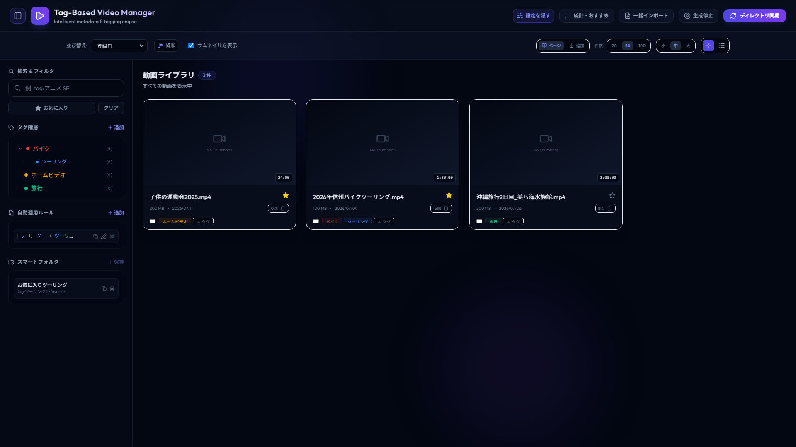
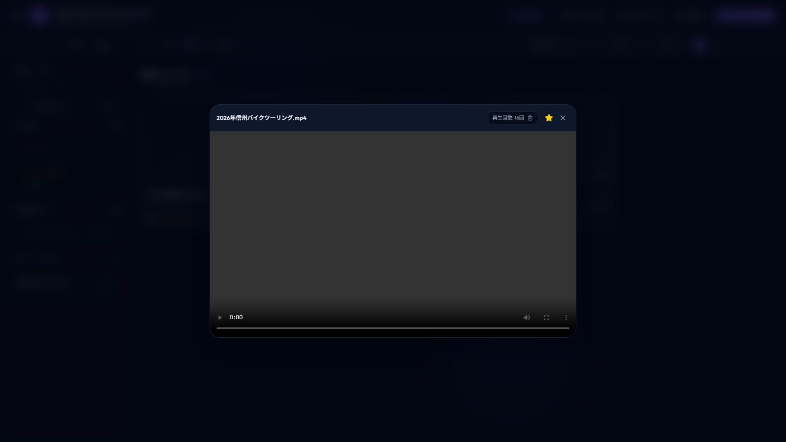
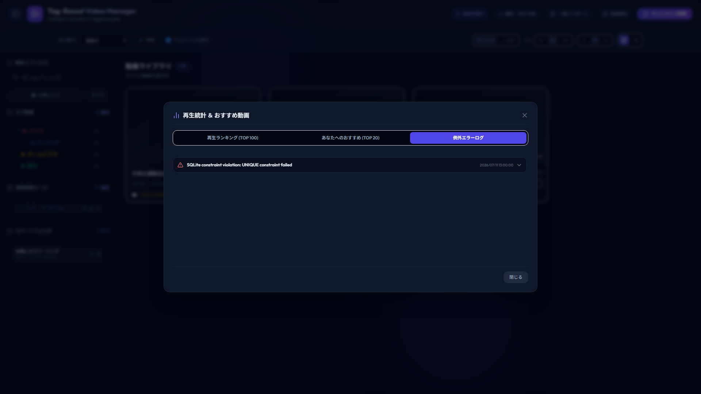
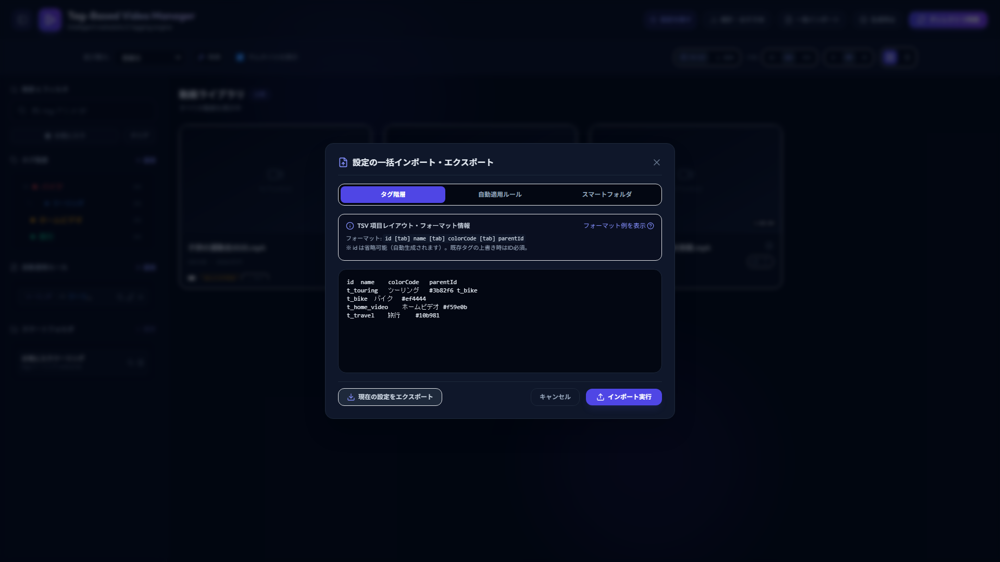

# TagBasedVideoManager

TagBasedVideoManagerは、バイクツーリングの記録、旅行動画、大切な家族のホームビデオなどの動画ファイルを、タグ情報や自動適用ルールに基づいて高度に分類・検索・整理できる、Webベースのパーソナル動画管理システムです。
ホストマシンの動画ディレクトリを読み取り専用でマウントし、非同期でメタデータ取得やサムネイル生成をバックグラウンド実行します。

---

## 主な機能 (Features)

### 1. 動画スキャン & メディア処理

- **即時DB登録**: 動画フォルダをスキャンした際は、ファイルシステム情報から最小限の情報だけを即座にデータベースへ登録します。動画の長さやサムネイルはバックグラウンドの非同期キューで並行処理されるため、スキャン操作が非常に軽快です。
- **サムネイル高速生成**: FFmpegのデコード負荷を避けるため、まず「高速シーク（コンテナシーク）」を試行し、失敗時のみ「安全シーク（デコードシーク）」へ自動フォールバックする2段階生成を導入しています。
- **デッドロック防止と並行制御**: ffprobeによるメタデータ取得はセマフォ制限から除外して非同期・並列実行し、FFmpegプロセス呼び出し時の標準出力と標準エラー出力を並行タスクで読み取ることでデッドロックを防止しています。

### 2. 自己参照階層型タグ

- **ツリー構造**: 親子階層関係を持つタグを無制限に定義できます。
- **動的件数バッジ**: 各タグに紐づく動画件数をSQLの再帰CTE（階層問い合わせ）により自動集計し、ツリーの横にバッジとして常時表示します。
- **開閉・レイアウト開閉**: Alpine.jsによりツリー構造 of 開閉状態を保持・トグル可能です。

### 3. 自動適用ルール & 遡及適用

- **詳細なルール条件**: 動画のタイトルやパス、親フォルダ名に対して、部分一致・前方一致・後方一致・正規表現一致、ファイルサイズ範囲などを細かく指定してタグを自動紐付けできます。
- **遡及適用**: 新しいルールを作成した際、すでに登録されている既存の動画に対してもバックグラウンドで非同期にルールを遡及適用できます。

### 4. 高度な AND/OR 検索 & スマートフォルダ

- **検索DSL**: 検索欄に「`tag:タグ名`」や「`is:favorite`」、「`and`/`or`」を用いた構文を入力して高度な論理演算フィルタリングが可能です。
- **スマートフォルダ**: 検索条件をワンクリックで保存し、サイドバーから即座に適用できます。

### 5. 再生履歴の記録・分析・おすすめ機能

- **再生回数と日時の記録**: シークバー操作の多重カウントを排除し、専用のAPIを介して再生開始時のみカウントをインクリメントします。
- **あなたへのおすすめ**: 再生履歴のファイル名形態素/キーワードを独自のハイブリッド抽出アルゴリズムで解析し、未再生動画から優先的にお勧め動画を嗜好キーワード付きで自動レコメンドします。
- **再生数ランキング**: 最多再生動画トップ100を簡単に確認できます。
- **例外ログモニタリング**: アプリ内で発生した例外をDBに保存し、管理者ダッシュボードからスタックトレースを展開表示可能です。

### 6. 一括設定インポート・エクスポート

- タグ階層、自動ルール、スマートフォルダの設定情報を、WebAPIフォーマット（TSV / JSON）で一括インポート・エクスポートできます。

### 7. デスクトップコンパニオン: AI File Renamer (長パス短縮＆Docker制御)

- **Dockerバインドマウント（WSL2/9p）の260文字制限対策**: ホストOS上の動画フォルダを走査し、240文字以上の長パス危険ファイルを自動抽出。
- **スキャン直後の即時IO描画 & 非同期逐次提案パイプライン**: スキャン完了直後に全対象ファイルを即時一覧表示。並行度制御（1〜2並行）により1件ずつ非同期に行アニメーションを表示しながら提案を順次反映。
- **DuckDuckGo Search (ddgs) 連携**: 作品名・タイトルのWeb検索結果（上位スニペット）をLLMプロンプトに注入し、高精度な正式名称・短縮理由を提案（Python未導入時は安全に通常プロンプトへ自動フォールバック）。
- **3行常時固定表示レイアウト & AFTERラベル警告**: 各カードで「旧ファイル名 (BEFORE)」「新ファイル名 (AFTER)」「AIコメント (AI COMMENT)」を常時固定表示。AFTER行は緑色基調とし、閾値抵触時は「AFTER (〇〇字 [危険])」のラベルバッジ背景のみを赤色警告表示。
- **操作性・誤リネーム防止 & 中止機能**: AI提案中はリネームボタンを非活性化して進捗バッジを表示。ツールバーに「⏹ 中止」ボタンを常時配置し、新条件での即時再抽出・提案リスタートにも対応。
- **シンボリックリンク／ジャンクション安全走査**: ディレクトリジャンクションを解釈・追跡し、循環参照（同一ディレクトリ再帰）を自動検知して安全にスキップ。
- **OpenRouter モデルによる短縮AI提案**: 命名規則（日時_タイトル等）に基づき、Free/有料モデルを活用して安全な短縮ファイル名およびAIコメントを常時提示。
- **ワンクリック復旧 & Undo**: 物理リネーム実行と同時にDockerコンテナを自動再起動して即時マウント復旧。直前のリネームを元のファイル名に完全復元する逆リネーム（Undo）に対応。
- **柔軟な設定管理 (.NET標準 `appsettings.json` / `.env`)**: 設定ファイルはAppData（`%APPDATA%\TagBasedVideoManager\appsettings.json`）およびアプリ実行フォルダ（ポータブル運用）を自動判定。`.env` ファイルからのインポートに対応（※OS環境変数は参照せず安全性を担保）し、APIキー未設定時も「未提案」状態で安全起動。
- **100% F# .NET 10 + Avalonia.FuncUI Elmish MVU**: 既存Webアプリのコードに一切手を加えない（改修行数ゼロ）完全独立デスクトップアプリ。

---

## 画面イメージ (Screenshots)

### メイン画面 (動画ライブラリ)


_(動画の一覧、お気に入り登録、複数選択、タグによる絞り込み等の操作を行うメインUIです)_

### 動画再生モーダル


_(HTTP 206 Rangeリクエストによるスムーズなシークに対応した組み込み動画プレイヤーです)_

### 分析ダッシュボード・エラーログ


_(再生ランキング、あなたへのおすすめ動画リスト、およびシステム例外エラーログが確認できます)_

### 設定管理モーダル


_(タグ階層のCRUD、自動ルールの定義、およびTSV/JSONによる設定の一括入出力を行うUIです)_

---

## 動作環境 (Requirements)

- **OS**: Windows 11 / Linux (Docker)
- **ランタイム**: .NET 10 SDK (ローカル開発時)
- **データベース**: SQLite 3
- **コンテナ環境**: Docker, Docker Compose

### GPUアクセラレーション対応

FFmpegによるサムネイル生成時にホストマシンのグラフィックボードを利用可能です。

- **NVIDIA GPU**: CUDAアクセラレーション
- **AMD GPU**: VAAPI/DirectX支援
- **CPUのみ**: 通常のソフトウェアデコード

---

## セットアップと起動手順 (Setup & Usage)

### 1. リポジトリのクローン

```bash
git clone https://github.com/your-username/TagBasedVideoManager.git
cd TagBasedVideoManager
```

### 2. 環境変数の設定

プロジェクトルートに `.env` ファイルを作成し、以下の変数を定義します（Webアプリ・デスクトップアプリ共通）。

```env
PORT=5620
VIDEO_DIR=C:\Users\YourUserName\Videos
THUMBNAIL_DIR=C:\Users\YourUserName\TagBasedVideoManagerData\thumbnails
DATABASE_PATH=C:\Users\YourUserName\TagBasedVideoManagerData\metadata.db

# 以下は AI File Renamer (デスクトップアプリ) 用のオプション設定
OPENROUTER_API_KEY=sk-or-v1-xxxxxxxx
OPENROUTER_MODEL=google/gemini-2.0-flash-lite-preview-02-05:free
PATH_LENGTH_THRESHOLD=240
```

### 3. Docker Composeによるコンテナ起動 (Web アプリ)

`docker-compose.yml` で利用するデバイス（GPU）に合わせて以下の設定変更を行います。

- **CPUのみ (デフォルト)**:
  `docker-compose.yml` のGPU専用セクション（`devices` または `deploy.resources`）がコメントアウトされていることを確認します。
- **AMD GPUを利用する場合**:
  `devices:` および `/dev/dri` のコメントアウトを解除します。
- **NVIDIA GPUを利用する場合**:
  `deploy.resources.reservations.devices` セクションのコメントアウトを解除します。

起動コマンドを実行します：

```bash
docker compose up -d --build
```

ブラウザから `http://localhost:5620` にアクセスします。

### 4. AI File Renamer の構成設定 (`appsettings.json` / `.env`)

AI File Renamer は ASP.NET Core / .NET 標準の構成思想に準拠し、ベース構成ファイル `appsettings.json` および環境別設定ファイル `appsettings.{Environment}.json`（`appsettings.Development.json` や `appsettings.Production.json` 等）、ならびに環境設定ファイル (`.env`) から各種設定を読み込み・マージします。

#### (1) 環境名の解決と階層オーバーライドマージ

- **環境名の解決順序**:
  1. OS 環境変数 `DOTNET_ENVIRONMENT`
  2. OS 環境変数 `ASPNETCORE_ENVIRONMENT`
  3. コンパイル時ビルド構成（Debug ビルド時は `Development`、Release ビルド時は `Production`）
- **階層マージ**:
  ベースとなる `appsettings.json` を読み込んだ上で、該当する環境別設定ファイル（例: `appsettings.Development.json`）が存在する場合、キー単位でオーバーライドマージされます（環境別ファイルで未定義のキーはベース値が維持されます）。
  さらに `.env` が存在する場合は指定されたキーが最終的にオーバーライドされます。

#### (2) 設定読み込みの探索優先順位

1. **ユーザー個別設定**: `%APPDATA%\TagBasedVideoManager\appsettings.json` (Windows: `C:\Users\<UserName>\AppData\Roaming\TagBasedVideoManager\appsettings.json`)
2. **カレントディレクトリ**: `./appsettings.json` および `./appsettings.{Environment}.json`
3. **アプリケーション実行ディレクトリ**: `{AppDirectory}\appsettings.json` および `{AppDirectory}\appsettings.{Environment}.json` (ポータブル運用向け)
4. **環境設定ファイル**: `.env` (上記 `VIDEO_DIR`, `OPENROUTER_API_KEY` 等)
5. **組み込み既定値**

※**OS環境変数の非参照**: システム全体や別アプリケーションの意図しない環境変数が混入・干渉することを防ぐため、設定値そのものはOS環境変数から直接参照しません（環境名指定用 `DOTNET_ENVIRONMENT` / `ASPNETCORE_ENVIRONMENT` を除く）。設定は構成ファイル（`appsettings*.json`）またはプロジェクト/カレントの `.env` ファイルに定義してください。

#### (3) 設定ファイルの保存先パス決定ロジック

- アプリケーション実行ディレクトリに既に `appsettings.json` が配置されている場合、そのファイルを直接上書き更新します（ポータブル運用の維持）。
- 配置されていない場合、アクセス権限エラー（Program Files 配下等）を防止するため、ユーザープロファイル配下（`%APPDATA%\TagBasedVideoManager\appsettings.json`）にディレクトリを自動作成して安全に保存します。

#### (4) `appsettings.json` の書式例

```json
{
  "PathLengthThreshold": 240,
  "TargetDirectory": "C:\\Users\\YourUserName\\Videos",
  "OpenRouterApiKey": "sk-or-v1-xxxxxxxxxxxxxxxx",
  "OpenRouterModel": "google/gemini-2.0-flash-lite-preview-02-05:free",
  "NamingRules": [
    {
      "Id": "rule-1",
      "Name": "日付+タイトル",
      "Pattern": "{yyyyMMdd}_{Title}",
      "Description": "撮影日とタイトルをアンダースコアで結合"
    },
    {
      "Id": "rule-2",
      "Name": "タイトルのみ",
      "Pattern": "{Title}",
      "Description": "不要なプレフィックスを除去したタイトルのみ"
    }
  ]
}
```

※`NamingRules` の先頭に定義されたルールが起動時の既定ルールとして自動適用されます。
※`OpenRouterApiKey` が未設定または空文字の場合、AIファイル名の自動提案は行われず「未提案」状態（元のファイル名維持）で安全に起動します。

#### (5) `.env` 環境変数との対応表

| 環境変数名              | appsettings.json キー | 既定値                                            | 説明                                         |
| :---------------------- | :-------------------- | :------------------------------------------------ | :------------------------------------------- |
| `VIDEO_DIR`             | `TargetDirectory`     | `""`                                              | 走査対象の動画フォルダパス                   |
| `PATH_LENGTH_THRESHOLD` | `PathLengthThreshold` | `240`                                             | 長パス警告・抽出基準文字数                   |
| `OPENROUTER_API_KEY`    | `OpenRouterApiKey`    | `""`                                              | OpenRouter APIキー（未設定時はAI未提案表示） |
| `OPENROUTER_MODEL`      | `OpenRouterModel`     | `google/gemini-2.0-flash-lite-preview-02-05:free` | 短縮提案に使用するAIモデル                   |

---

## 開発者向け情報とテスト実行 (For Developers & Testing)

### ローカル起動 (Web アプリケーション)

```bash
cd src/TagBasedVideoManager
dotnet run
```

### ローカル起動 (AI File Renamer デスクトップアプリ)

```bash
cd src/TagBasedVideoManager.Renamer
dotnet run
```

### 自動テストとカバレッジ測定

本プロジェクトは MTP (Microsoft Testing Platform) および `coverlet.MTP` を用いた品質検証を導入しています。

#### 1. Web アプリケーション テスト (Unit / Integration / Playwright E2E)

```powershell
# Webアプリのテスト実行とカバレッジレポート生成
pwsh ./test/TagBasedVideoManager.Tests/run_tests_with_coverage.ps1
```

- **成果物出力先**: `test/TagBasedVideoManager.Tests/TestResults/TestRun_yyyy-MM-dd_HH_mm_ss/`

#### 2. AI File Renamer デスクトップアプリ テスト (Unit / 結合 E2E)

```powershell
# Renamerアプリのテスト実行とカバレッジレポート生成
pwsh ./test/TagBasedVideoManager.Renamer.Tests/run_tests_with_coverage.ps1
```

- **成果物出力先**: `test/TagBasedVideoManager.Renamer.Tests/TestResults/TestRun_yyyy-MM-dd_HH_mm_ss/`

---

## ライセンス

[MIT License](LICENSE)
