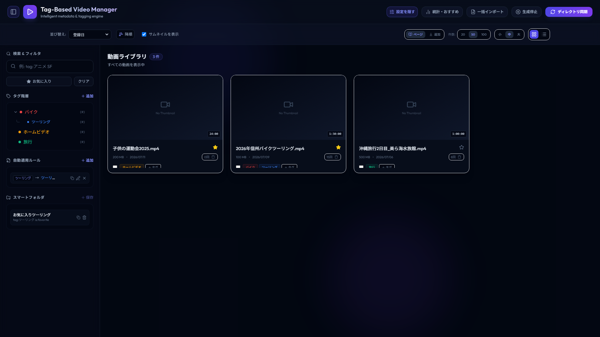
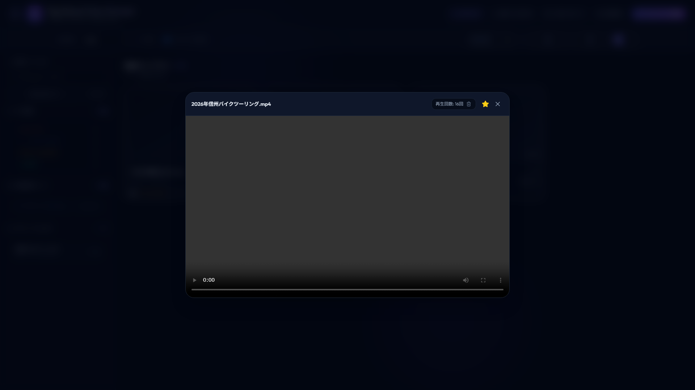
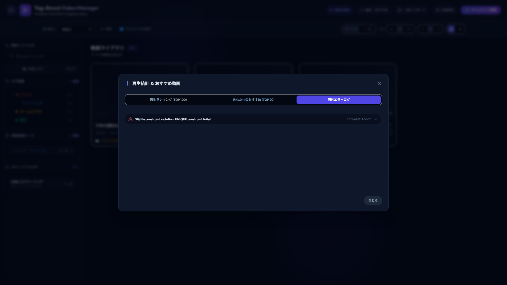
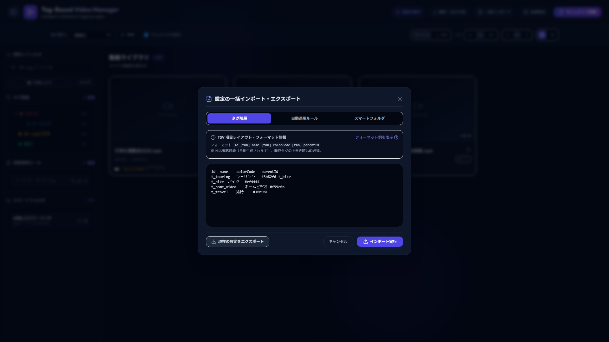

# TagBasedVideoManager

TagBasedVideoManagerは、バイクツーリングの記録、旅行動画、大切な家族のホームビデオなどの動画ファイルを、タグ情報や自動適用ルールに基づいて高度に分類・検索・整理できる、Webベースのパーソナル動画管理システムです。
ホストマシンの動画ディレクトリを読み取り専用でマウントし、非同期でメタデータ取得やサムネイル生成をバックグラウンド実行します。

---

## 主な機能 (Features)

### 1. 動画スキャン & メディア処理

- **即時DB登録**: 動画フォルダをスキャンした際は、ファイルシステム情報から最小限の情報だけを即座にデータベースへ登録します。動画の長さやサムネイルはバックグラウンドの非同期キューで並行処理されるため、スキャン操作が非常に軽快です。
- **決定論的UUID（UUID v5）による移動・リネーム・マウント変更自動追従**: 動画ファイル本体を一切変更せず（Read-Only サンプリング）、ファイルサイズと先頭・中間・末尾 64KB のデータから RFC 9562 準拠の UUID v5 を算出。サブフォルダ移動、ファイル名リネーム（AI File Renamer 等）、および Docker バインドマウント変更時でも既存の動画 ID、タグ、お気に入り、再生回数、再生時間を自動引き継ぎし、FFmpeg / ffprobe による重い再処理を完全にスキップします。
- **不在レコード & 孤児サムネイルの自動クリーンアップ**: ディスク上から物理削除された動画の DB レコード・タグ紐付け・サムネイル画像、および DB に対応動画が存在しない孤児サムネイル画像をスキャン時に自動削除します。万一の走査例外時（ネットワーク瞬断や権限エラー）にも誤削除を防ぐ防御ガードを備えています。
- **サムネイル高速生成**: FFmpegのデコード負荷を避けるため、まず「高速シーク（コンテナシーク）」を試行し、失敗時のみ「安全シーク（デコードシーク）」へ自動フォールバックする2段階生成を導入しています。
- **デッドロック防止と並行制御**: ffprobeによるメタデータ取得はセマフォ制限から除外して非同期・並列実行し、FFmpegプロセス呼び出し時の標準出力と標準エラー出力を並行タスクで読み取ることでデッドロックを防止しています。

### 2. 自己参照階層型タグ

- **ツリー構造**: 親子階層関係を持つタグを無制限に定義できます。
- **動的件数バッジ**: 各タグに紐づく動画件数をSQLの再帰CTE（階層問い合わせ）により自動集計し、ツリーの横にバッジとして常時表示します。
- **開閉・レイアウト開閉**: Alpine.jsによりツリー構造 of 開閉状態を保持・トグル可能です。

### 3. 自動適用ルール & 遡及適用

- **詳細なルール条件**: 動画のタイトルやパス、親フォルダ名に対して、部分一致・前方一致・後方一致・正規表現一致、ファイルサイズ範囲などを細かく指定してタグを自動紐付けできます。
- **遡及適用**: 新しいルールを作成した際、すでに登録されている既存の動画に対してもバックグラウンドで非同期にルールを遡及適用できます。

### 4. 高度な AND/OR 検索 & スマートフォルダ

- **検索DSL**: 検索欄に「`tag:タグ名`」や「`is:favorite`」、「`and`/`or`」を用いた構文を入力して高度な論理演算フィルタリングが可能です。
- **スマートフォルダ**: 検索条件をワンクリックで保存し、サイドバーから即座に適用できます。

### 5. 再生履歴の記録・分析・おすすめ機能

- **再生回数と日時の記録**: シークバー操作の多重カウントを排除し、専用のAPIを介して再生開始時のみカウントをインクリメントします。
- **あなたへのおすすめ**: 再生履歴のファイル名形態素/キーワードを独自のハイブリッド抽出アルゴリズムで解析し、未再生動画から優先的にお勧め動画を嗜好キーワード付きで自動レコメンドします。
- **再生数ランキング**: 最多再生動画トップ100を簡単に確認できます。
- **例外ログモニタリング**: アプリ内で発生した例外をDBに保存し、管理者ダッシュボードからスタックトレースを展開表示可能です。

### 6. 一括設定インポート・エクスポート

- タグ階層、自動ルール、スマートフォルダの設定情報を、WebAPIフォーマット（TSV / JSON）で一括インポート・エクスポートできます。

### 7. デスクトップコンパニオン: AI File Renamer (長パス短縮＆Docker制御)

- **Dockerバインドマウント（WSL2/9p）の260文字制限対策**: ホストOS上の動画フォルダを走査し、240文字以上の長パス危険ファイルを自動抽出。
- **スキャン直後の即時IO描画 & 非同期逐次提案パイプライン**: スキャン完了直後に全対象ファイルを即時一覧表示。並行度制御（1〜2並行）により1件ずつ非同期に行アニメーションを表示しながら提案を順次反映。
- **DuckDuckGo Search (ddgs) 連携**: 作品名・タイトルのWeb検索結果（上位スニペット）をLLMプロンプトに注入し、高精度な正式名称・短縮理由を提案（Python未導入時は安全に通常プロンプトへ自動フォールバック）。
- **3行常時固定表示レイアウト & AFTERラベル警告**: 各カードで「旧ファイル名 (BEFORE)」「新ファイル名 (AFTER)」「AIコメント (AI COMMENT)」を常時固定表示。AFTER行は緑色基調とし、閾値抵触時は「AFTER (〇〇字 [危険])」のラベルバッジ背景のみを赤色警告表示。
- **操作性・誤リネーム防止 & 中止機能**: AI提案中はリネームボタンを非活性化して進捗バッジを表示。ツールバーに「⏹ 中止」ボタンを常時配置し、新条件での即時再抽出・提案リスタートにも対応。
- **シンボリックリンク／ジャンクション安全走査**: ディレクトリジャンクションを解釈・追跡し、循環参照（同一ディレクトリ再帰）を自動検知して安全にスキップ。
- **OpenRouter モデルによる短縮AI提案**: 命名規則（日時_タイトル等）に基づき、Free/有料モデルを活用して安全な短縮ファイル名およびAIコメントを常時提示。
- **ワンクリック復旧 & Undo**: 物理リネーム実行と同時にDockerコンテナを自動再起動して即時マウント復旧。直前のリネームを元のファイル名に完全復元する逆リネーム（Undo）に対応。
- **柔軟な設定管理 (.NET標準 `appsettings.json` / `.env`)**: 設定ファイルはAppData（`%APPDATA%\TagBasedVideoManager\appsettings.json`）およびアプリ実行フォルダ（ポータブル運用）を自動判定。`.env` ファイルからのインポートに対応（※OS環境変数は参照せず安全性を担保）し、APIキー未設定時も「未提案」状態で安全起動。
- **100% F# .NET 10 + Avalonia.FuncUI Elmish MVU**: 既存Webアプリのコードに一切手を加えない（改修行数ゼロ）完全独立デスクトップアプリ。

### 8. モバイルファースト UX & PWA / Web ブランディング

- **モバイル専用レスポンシブ UI (< 768px)**: 常設キーワード検索バー、ボトムシート型タグ階層ブラウザ、6色カラーパレット付き新規タグ作成、表示・ソート設定シート、100dvh & safe-area-inset 対応。
- **2列グリッド ⇄ スリムリストのワンタップ切り替え**: サムネイル重視の2列ギャラリー表示と、ファイル名重視の超高密度スリムリスト表示を即座に相互切り替え可能（既存機能の欠落ゼロ）。
- **全画面没入型プレイヤー & 連続視聴ナビゲーション**: 画面余白を排除した全画面プレイヤーで、一覧に戻ることなく「前の動画」「次の動画」へシームレスに移動可能。横向き（ランドスケープ）自動追従。
- **ブランドアプリアイコン & PWA スタンドアロン起動**: SVG/ICO ファビコンおよびマルチサイズ PNG アイコン（180/192/512）、Web App Manifest によるホーム画面追加と全画面スタンドアロン起動に対応。

---

## 画面イメージ (Screenshots)

### メイン画面 (動画ライブラリ)


_(動画の一覧、お気に入り登録、複数選択、タグによる絞り込み等の操作を行うメインUIです)_

### 動画再生モーダル


_(HTTP 206 Rangeリクエストによるスムーズなシークに対応した組み込み動画プレイヤーです)_

### 分析ダッシュボード・エラーログ


_(再生ランキング、あなたへのおすすめ動画リスト、およびシステム例外エラーログが確認できます)_

### 設定管理モーダル


_(タグ階層のCRUD、自動ルールの定義、およびTSV/JSONによる設定の一括入出力を行うUIです)_

---

---

## データベース設計 (SQLite Database Schema)

本システムはローカル運用のための軽量・単一ファイルデータベースとして SQLite を採用しています。バックエンド起動時にテーブルが自動マイグレーション・初期化され、`ErrorLogs` テーブルは自動クリーンアップされます。

```sql
-- 1. 動画メタデータテーブル
CREATE TABLE Videos (
    Id TEXT PRIMARY KEY,
    FileName TEXT NOT NULL,
    FilePath TEXT NOT NULL UNIQUE,
    Duration INTEGER NOT NULL,
    FileSize INTEGER NOT NULL,
    ThumbnailPath TEXT,
    IsFavorite INTEGER DEFAULT 0,
    CreatedAt TEXT NOT NULL,
    AccessCount INTEGER DEFAULT 0,
    LastAccessedAt TEXT,
    FileUuid TEXT
);

-- 2. タグ管理テーブル（自己参照階層）
CREATE TABLE Tags (
    Id TEXT PRIMARY KEY,
    Name TEXT NOT NULL UNIQUE,
    ColorCode TEXT DEFAULT '#71717a',
    ParentId TEXT,
    FOREIGN KEY (ParentId) REFERENCES Tags(Id) ON DELETE SET NULL
);

-- 3. ビデオ・タグ中間テーブル（多対多）
CREATE TABLE VideoTags (
    VideoId TEXT NOT NULL,
    TagId TEXT NOT NULL,
    PRIMARY KEY (VideoId, TagId),
    FOREIGN KEY (VideoId) REFERENCES Videos(Id) ON DELETE CASCADE,
    FOREIGN KEY (TagId) REFERENCES Tags(Id) ON DELETE CASCADE
);

-- 4. 自動タグ付けルールテーブル
CREATE TABLE TaggingRules (
    Id TEXT PRIMARY KEY,
    Pattern TEXT NOT NULL,
    TagId TEXT NOT NULL,
    MatchType TEXT DEFAULT 'partial', -- prefix, suffix, partial, regex
    TargetField TEXT DEFAULT 'fileName', -- fileName, filePath, folderName
    MinSize INTEGER, -- 最小ファイルサイズ (MB)
    MaxSize INTEGER, -- 最大ファイルサイズ (MB)
    CreatedAt TEXT NOT NULL,
    FOREIGN KEY (TagId) REFERENCES Tags(Id) ON DELETE CASCADE
);

-- 5. スマートフォルダテーブル
CREATE TABLE SmartFolders (
    Id TEXT PRIMARY KEY,
    Name TEXT NOT NULL,
    Query TEXT NOT NULL,
    CreatedAt TEXT NOT NULL
);

-- 6. 例外エラーログテーブル
CREATE TABLE ErrorLogs (
    Id INTEGER PRIMARY KEY AUTOINCREMENT,
    Message TEXT NOT NULL,
    StackTrace TEXT,
    CreatedAt TEXT NOT NULL
);
```

## 動作環境 (Requirements)

- **OS**: Windows 11 / Linux
- **ランタイム**: .NET 10 SDK (ローカル開発時)
- **データベース**: SQLite 3
- **コンテナ環境**: WSL 3.0 (wslc) / Docker / Podman

### GPUアクセラレーション対応

FFmpegによるサムネイル生成時にホストマシンのグラフィックボードを利用可能です。

- **NVIDIA GPU**: CUDAアクセラレーション
- **AMD GPU**: VAAPI/DirectX支援
- **CPUのみ**: 通常のソフトウェアデコード

---

## セットアップと起動手順 (Setup & Usage)

### 1. リポジトリのクローン

```bash
git clone https://github.com/your-username/TagBasedVideoManager.git
cd TagBasedVideoManager
```

### 2. 環境変数の設定

プロジェクトルートの `.env.sample` をコピーして `.env` ファイルを作成し、ご利用の環境（Windows / Linux / DevContainer）に合わせて変数を定義します（Webアプリ・デスクトップアプリ共通）。

```bash
cp .env.sample .env
```

```env
PORT=5620
# Web アプリ / コンテナ用の動画ルートフォルダ（セミコロン ';' 区切りで複数指定可能）
VIDEO_DIRS="C:\Users\YourUserName\Videos;D:\AnotherVideos"
THUMBNAIL_DIR=C:\Users\YourUserName\TagBasedVideoManagerData\thumbnails
DATABASE_PATH=C:\Users\YourUserName\TagBasedVideoManagerData\metadata.db

# 以下は AI File Renamer (デスクトップアプリ) 専用の設定
VIDEO_DIR=C:\Users\YourUserName\Videos
OPENROUTER_API_KEY=sk-or-v1-xxxxxxxx
OPENROUTER_MODEL=google/gemini-2.0-flash-lite-preview-02-05:free
PATH_LENGTH_THRESHOLD=240
```

> [!IMPORTANT]
> **VIDEO_DIRS（複数フォルダ指定）に関する重要事項**:
>
> - **旧 `VIDEO_DIR` からの移行**: Web アプリ本体およびコンテナ環境では旧 `VIDEO_DIR` は廃止され、`VIDEO_DIRS` に一本化されました。未設定や旧変数の残存時は設定例付きエラーとなり起動・スキャンできません。
> - **複数物理フォルダの指定**: セミコロン（`;`）で区切ることで、ドライブや物理パスの異なる複数の動画フォルダを同時に管理できます。
> - **ルート名タグの自動導出**: 各フォルダのフォルダ名（Leaf 名）およびそのサブフォルダ名が、スキャン時に動画タグとして自動付与されます（重複タグは統合）。
> - **ドライブ直下の禁止**: `D:\` や `/` などのルートパスは、コンテナマウント先フォルダ名を決定できないため指定できません。必ずサブフォルダを指定してください。
> - **フォルダ名重複の禁止**: 指定する複数フォルダのフォルダ名（大文字小文字を区別せず）が重複している場合、マウント先衝突エラーとなります。異なるフォルダ名を指定してください。
> - **Docker 環境での `FilePath` 変更に関する注意**: Docker / コンテナ環境では、各フォルダが `/app/videos/<フォルダ名>` に読み取り専用マウントされます。ホスト側ローカル実行から Docker コンテナ実行への切り替えやマウント設定の変更により `FilePath` が変化した場合でも、決定論的 UUID（UUID v5）およびファイルサイズ等のフォールバックにより既存の動画 ID・タグ・視聴履歴・サムネイルが自動的に引き継がれます（DB ファイルの再作成は不要です）。

### 3. コンテナ起動 (Web アプリ)

本アプリは単一コンテナ構成であり、直接 OCI ランタイムから起動できます。
Windows 11（WSL 3.0 / Docker Desktop）および Linux（Docker / Podman）向けに、ワンクリックでビルド・再起動・ヘルスチェックおよび GPU アクセラレーション自動設定を行うデプロイスクリプトを用意しています。

- **Windows 11 (WSL 3.0 または Docker Desktop)**:
  PowerShell で以下を実行します。WSL 3.0 (`wslc`) または `docker` を自動検出し、ポート 5620 の事前チェック、旧コンテナの安全な停止・削除、イメージビルド、コンテナ再起動（NVIDIA GPU 検出時は `--gpus all` を自動付与）、およびヘルスチェック（失敗時は自動で `logs` を表示）を実行します。

  ```powershell
  pwsh ./scripts/deploy.ps1
  ```

  ※WSL 3.0 (`wslc`) 利用時は Docker Desktop なしで直接コンテナを稼働できます。

- **Linux (Docker または Podman)**:
  Bash で以下を実行します。`docker` または `podman` を自動検出し、NVIDIA GPU（`--gpus all`）または AMD GPU（`/dev/dri`）の自動パススルーを含めてデプロイします。

  ```bash
  ./scripts/deploy.sh
  ```

ブラウザから `http://localhost:5620` にアクセスします。

### 4. AI File Renamer の構成設定 (`appsettings.json` / `.env`)

AI File Renamer は ASP.NET Core / .NET 標準の構成思想に準拠し、ベース構成ファイル `appsettings.json` および環境別設定ファイル `appsettings.{Environment}.json`（`appsettings.Development.json` や `appsettings.Production.json` 等）、ならびに環境設定ファイル (`.env`) から各種設定を読み込み・マージします。

#### (1) 環境名の解決と階層オーバーライドマージ

- **環境名の解決順序**:
  1. OS 環境変数 `DOTNET_ENVIRONMENT`
  2. OS 環境変数 `ASPNETCORE_ENVIRONMENT`
  3. コンパイル時ビルド構成（Debug ビルド時は `Development`、Release ビルド時は `Production`）
- **階層マージ**:
  ベースとなる `appsettings.json` を読み込んだ上で、該当する環境別設定ファイル（例: `appsettings.Development.json`）が存在する場合、キー単位でオーバーライドマージされます（環境別ファイルで未定義のキーはベース値が維持されます）。
  さらに `.env` が存在する場合は指定されたキーが最終的にオーバーライドされます。

#### (2) 設定読み込みの探索優先順位

1. **ユーザー個別設定**: `%APPDATA%\TagBasedVideoManager\appsettings.json` (Windows: `C:\Users\<UserName>\AppData\Roaming\TagBasedVideoManager\appsettings.json`)
2. **カレントディレクトリ**: `./appsettings.json` および `./appsettings.{Environment}.json`
3. **アプリケーション実行ディレクトリ**: `{AppDirectory}\appsettings.json` および `{AppDirectory}\appsettings.{Environment}.json` (ポータブル運用向け)
4. **環境設定ファイル**: `.env` (上記 `VIDEO_DIR`, `OPENROUTER_API_KEY` 等)
5. **組み込み既定値**

※**OS環境変数の非参照**: システム全体や別アプリケーションの意図しない環境変数が混入・干渉することを防ぐため、設定値そのものはOS環境変数から直接参照しません（環境名指定用 `DOTNET_ENVIRONMENT` / `ASPNETCORE_ENVIRONMENT` を除く）。設定は構成ファイル（`appsettings*.json`）またはプロジェクト/カレントの `.env` ファイルに定義してください。

#### (3) 設定ファイルの保存先パス決定ロジック

- アプリケーション実行ディレクトリに既に `appsettings.json` が配置されている場合、そのファイルを直接上書き更新します（ポータブル運用の維持）。
- 配置されていない場合、アクセス権限エラー（Program Files 配下等）を防止するため、ユーザープロファイル配下（`%APPDATA%\TagBasedVideoManager\appsettings.json`）にディレクトリを自動作成して安全に保存します。

#### (4) `appsettings.json` の書式例

```json
{
  "PathLengthThreshold": 240,
  "TargetDirectory": "C:\\Users\\YourUserName\\Videos",
  "OpenRouterApiKey": "sk-or-v1-xxxxxxxxxxxxxxxx",
  "OpenRouterModel": "google/gemini-2.0-flash-lite-preview-02-05:free",
  "NamingRules": [
    {
      "Id": "rule-1",
      "Name": "日付+タイトル",
      "Pattern": "{yyyyMMdd}_{Title}",
      "Description": "撮影日とタイトルをアンダースコアで結合"
    },
    {
      "Id": "rule-2",
      "Name": "タイトルのみ",
      "Pattern": "{Title}",
      "Description": "不要なプレフィックスを除去したタイトルのみ"
    }
  ]
}
```

※`NamingRules` の先頭に定義されたルールが起動時の既定ルールとして自動適用されます。
※`OpenRouterApiKey` が未設定または空文字の場合、AIファイル名の自動提案は行われず「未提案」状態（元のファイル名維持）で安全に起動します。

#### (5) 環境変数対応表

##### Web アプリケーション / コンテナ環境

| 環境変数名      | 必須 | 既定値 (コンテナ内)     | 説明                                                                                    |
| :-------------- | :--- | :---------------------- | :-------------------------------------------------------------------------------------- |
| `PORT`          | 任意 | `5620`                  | アプリケーションがリッスンする HTTP ポート                                              |
| `VIDEO_DIRS`    | 必須 | なし                    | 走査対象の動画ルートフォルダ群（セミコロン `;` 区切りで複数指定可能、ドライブ直下不可） |
| `THUMBNAIL_DIR` | 任意 | `/app/data/thumbnails`  | 生成されたサムネイル画像の保存ディレクトリ                                              |
| `DATABASE_PATH` | 任意 | `/app/data/metadata.db` | メタデータ SQLite データベースファイルのパス                                            |

##### AI File Renamer (デスクトップアプリ)

| 環境変数名              | appsettings.json キー | 既定値                                            | 説明                                           |
| :---------------------- | :-------------------- | :------------------------------------------------ | :--------------------------------------------- |
| `VIDEO_DIR`             | `TargetDirectory`     | `""`                                              | 走査対象の動画フォルダパス（単一フォルダ指定） |
| `PATH_LENGTH_THRESHOLD` | `PathLengthThreshold` | `240`                                             | 長パス警告・抽出基準文字数                     |
| `OPENROUTER_API_KEY`    | `OpenRouterApiKey`    | `""`                                              | OpenRouter APIキー（未設定時はAI未提案表示）   |
| `OPENROUTER_MODEL`      | `OpenRouterModel`     | `google/gemini-2.0-flash-lite-preview-02-05:free` | 短縮提案に使用するAIモデル                     |

---

## 開発者向け情報とテスト実行 (For Developers & Testing)

### DevContainer による開発環境 (VS Code)

本リポジトリには VS Code DevContainer 定義（`.devcontainer/`）が含まれており、ローカル環境に .NET SDK や FFmpeg を個別にセットアップすることなく、コンテナ内で統一された開発環境を即座に立ち上げることができます。

- **含まれるツール**:
  - .NET 10 SDK
  - FFmpeg / ffprobe
  - SQLite3
  - F# (Ionide-fsharp) / C# DevKit 拡張機能
- **開発用ポートの分離 (5621)**:
  本番用コンテナ（ポート 5620）とのポート競合を防ぐため、DevContainer 開発環境は **ポート 5621**（環境変数 `PORT=5621`）に分離・自動フォワードされています。常用コンテナを起動したまま安全に並行開発が可能です。
- **Windows バインドマウント権限対策 (`remoteUser: "root"`)**:
  Windows ホスト上のドライブをバインドマウントした際に MSBuild のタイムスタンプ更新（`MSB3374`）が権限エラーになるのを防ぐため、コンテナ内ユーザーは `root` に設定されています。
- **利用手順**:
  1. VS Code で本リポジトリを開きます。
  2. コマンドパレット（`Ctrl+Shift+P`）から `Dev Containers: Reopen in Container` を選択します（設定変更時は `Dev Containers: Rebuild Container` を実行）。
  3. コンテナ起動後、ターミナルで `dotnet run --project src/TagBasedVideoManager` を実行すると `http://localhost:5621` でアプリが立ち上がります。
- **デスクトップアプリ (`TagBasedVideoManager.Renamer`) 開発時の使い分け**:
  - **自動テスト・Headless UI テスト**: `Avalonia.Headless.XUnit` を採用しているため、DevContainer 内のターミナルでも `dotnet run --project test/TagBasedVideoManager.Renamer.Tests` で全テストを実行可能です。
  - **実画面（GUI）でのデバッグ実行**: Windows ホスト固有の長パス走査およびホスト側コンテナ CLI（`wslc.exe` / `docker.exe`）制御を行うため、実ウィンドウでの動作確認は **Windows ホスト側**で `dotnet run --project src/TagBasedVideoManager.Renamer` を実行してください。

### ローカル起動 (Web アプリケーション)

```bash
cd src/TagBasedVideoManager
dotnet run
```

### ローカル起動 (AI File Renamer デスクトップアプリ)

```bash
cd src/TagBasedVideoManager.Renamer
dotnet run
```

### 自動テストとカバレッジ測定

本プロジェクトは MTP (Microsoft Testing Platform) および `coverlet.MTP` を用いた品質検証を導入しています。

#### 1. Web アプリケーション テスト (Unit / Integration / Playwright E2E)

```powershell
# Webアプリのテスト実行とカバレッジレポート生成
pwsh ./test/TagBasedVideoManager.Tests/run_tests_with_coverage.ps1
```

- **成果物出力先**: `test/TagBasedVideoManager.Tests/TestResults/TestRun_yyyy-MM-dd_HH_mm_ss/`

#### 2. AI File Renamer デスクトップアプリ テスト (Unit / 結合 E2E)

```powershell
# Renamerアプリのテスト実行とカバレッジレポート生成
pwsh ./test/TagBasedVideoManager.Renamer.Tests/run_tests_with_coverage.ps1
```

- **成果物出力先**: `test/TagBasedVideoManager.Renamer.Tests/TestResults/TestRun_yyyy-MM-dd_HH_mm_ss/`

---

## ライセンス

[MIT License](LICENSE)
