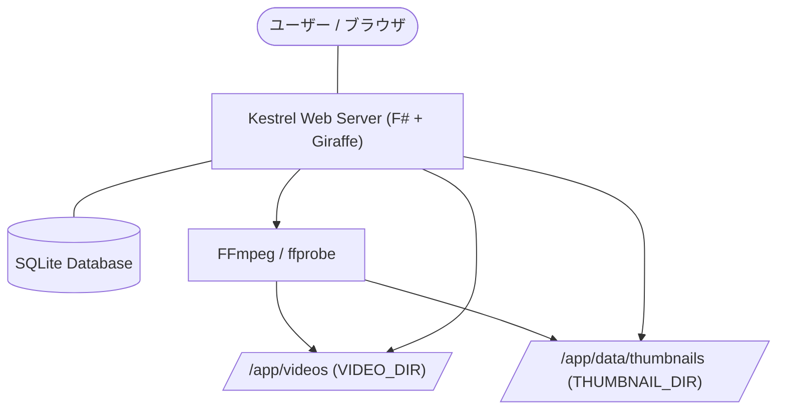

# 詳細設計書 (Design Detail)

## 1. システム構成とデータフロー

### 1.1 物理・データフロー構成
本システムは単一の Docker コンテナ内で動作し、ホストマシンの動画ディレクトリを読み取り専用でマウントして配信します。



### 1.2 マウント構造
- `/app/videos` (既定): ホストマシンの動画資産ディレクトリ (読み取り専用マウント)
- `/app/data/thumbnails` (既定): 自動生成されたサムネイル画像保存先 (永続化ボリューム)
- `/app/data/metadata.db` (既定): SQLite データベースファイル

---

## 2. データモデル設計

### 2.1 ドメインモデル定義 (`Domain.fs`)
F# の型定義を用いて、ビジネスモデルと発生しうるエラーを型安全に定義します。

```fsharp
namespace TagBasedVideoManager.Domain

open System

/// タグのドメインモデル (自己参照階層および紐付け件数バッジ対応)
type Tag = {
    Id: string
    Name: string
    ColorCode: string
    ParentId: string option
    VideoCount: int
}

/// 動画メタデータのドメインモデル
type Video = {
    Id: string
    FileName: string
    FilePath: string
    Duration: int64 // 秒数
    FileSize: int64 // バイト数
    ThumbnailPath: string option
    IsFavorite: bool
    CreatedAt: DateTime
    AccessCount: int
    LastAccessedAt: DateTime option
    Tags: Tag list
}

/// 自動タグ付けルールのドメインモデル
type TaggingRule = {
    Id: string
    Pattern: string
    TagId: string
    MatchType: string      // "prefix" | "suffix" | "partial" | "regex"
    TargetField: string    // "fileName" | "filePath" | "folderName"
    MinSize: int64 option  // 最小ファイルサイズ (MB)
    MaxSize: int64 option  // 最大ファイルサイズ (MB)
    CreatedAt: DateTime
}

/// スマートフォルダのドメインモデル
type SmartFolder = {
    Id: string
    Name: string
    Query: string
    CreatedAt: DateTime
}

/// 例外エラーログのドメインモデル
type ErrorLog = {
    Id: int
    Message: string
    StackTrace: string option
    CreatedAt: DateTime
}

/// データベースエラーの表現
type DbError =
    | ConnectionError of string
    | QueryError of string
    | RecordNotFound of string
    | UniqueConstraintViolation of string

/// メディア処理エラーの表現
type MediaError =
    | FFmpegExecutionError of string
    | FileNotFound of string
    | InvalidFormat of string
```

### 2.2 データベース物理スキーマ設計

```sql
-- 1. 動画メタデータテーブル
CREATE TABLE IF NOT EXISTS Videos (
    Id TEXT PRIMARY KEY,
    FileName TEXT NOT NULL,
    FilePath TEXT NOT NULL UNIQUE,
    Duration INTEGER NOT NULL,
    FileSize INTEGER NOT NULL,
    ThumbnailPath TEXT,
    IsFavorite INTEGER DEFAULT 0,
    CreatedAt TEXT NOT NULL,
    AccessCount INTEGER DEFAULT 0,
    LastAccessedAt TEXT
);

-- 2. タグ管理テーブル
CREATE TABLE IF NOT EXISTS Tags (
    Id TEXT PRIMARY KEY,
    Name TEXT NOT NULL UNIQUE,
    ColorCode TEXT DEFAULT '#71717a',
    ParentId TEXT,
    FOREIGN KEY (ParentId) REFERENCES Tags(Id) ON DELETE SET NULL
);

-- 3. ビデオ・タグ中間テーブル（多対多）
CREATE TABLE IF NOT EXISTS VideoTags (
    VideoId TEXT NOT NULL,
    TagId TEXT NOT NULL,
    PRIMARY KEY (VideoId, TagId),
    FOREIGN KEY (VideoId) REFERENCES Videos(Id) ON DELETE CASCADE,
    FOREIGN KEY (TagId) REFERENCES Tags(Id) ON DELETE CASCADE
);

-- 4. 自動タグ付けルールテーブル
CREATE TABLE IF NOT EXISTS TaggingRules (
    Id TEXT PRIMARY KEY,
    Pattern TEXT NOT NULL,
    TagId TEXT NOT NULL,
    MatchType TEXT DEFAULT 'partial',
    TargetField TEXT DEFAULT 'fileName',
    MinSize INTEGER,
    MaxSize INTEGER,
    CreatedAt TEXT NOT NULL,
    FOREIGN KEY (TagId) REFERENCES Tags(Id) ON DELETE CASCADE
);

-- 5. スマートフォルダテーブル
CREATE TABLE IF NOT EXISTS SmartFolders (
    Id TEXT PRIMARY KEY,
    Name TEXT NOT NULL,
    Query TEXT NOT NULL,
    CreatedAt TEXT NOT NULL
);

-- 6. エラーログテーブル
CREATE TABLE IF NOT EXISTS ErrorLogs (
    Id INTEGER PRIMARY KEY AUTOINCREMENT,
    Message TEXT NOT NULL,
    StackTrace TEXT,
    CreatedAt TEXT NOT NULL
);
```

---

## 3. バックエンド詳細設計

### 3.1 データベースアクセスモジュール (`Db.fs`)
- **データベース接続**: `SqliteConnection` および `Dapper` を利用し、クエリを実行します。
- **自動マイグレーション (`initializeDatabase`)**:
  - 各テーブルを `CREATE TABLE IF NOT EXISTS` で生成します。
  - `PRAGMA table_info(TaggingRules)` を実行し、`MatchType`/`TargetField`/`MinSize`/`MaxSize` が存在しない場合は `ALTER TABLE` による自動カラム追加を行います。
  - 同様に `Videos` に `AccessCount` / `LastAccessedAt` カラムを、`Tags` に `ParentId` カラムを動的追加します。
  - アプリケーション起動時に `DELETE FROM ErrorLogs` を実行してエラーログテーブルを自動的に全クリアします。
- **再帰CTEによるタグ階層検索**:
  - 親タグが選択された際、その子孫タグが付与された動画も再帰的に引き当てるため、`WITH RECURSIVE` クエリを動的に生成して動画を検索します。
- **再帰CTEによるタグ階層の件数積算 (`getTags`)**:
  - タグ一覧取得時、各タグの紐付け件数バッジ（`VideoCount`）を算出するため、再帰的 CTE クエリ (`WITH RECURSIVE TagHierarchy`) を実行します。これにより、親タグ自身に動画が直接紐づいていなくても、その子孫タグのいずれかに紐づいている動画のユニーク（重複排除）件数を自動的に積算して取得します。
- **ハイブリッドお勧め抽出アルゴリズム**:
  - `AccessCount >= 1` の動画のファイル名を取得し、後述するキーワード抽出によって嗜好ワードを決定。
  - そのワードを含む未再生（`AccessCount = 0`）動画を優先的にDBから20件取得して返却します。

### 3.2 検索DSLモジュール (`SearchDsl.fs`)
- 検索入力された文字列をスペースでパースして抽象構文木 (`SearchQuery`) を生成します。
- **構文解析ルール**:
  - `tag:タグ名` : タグ一致トークン `TagName`
  - `is:favorite` / `favorite:true` : お気に入りトークン `FavoriteOnly`
  - `or` / `and` (大文字小文字不問) : 論理演算トークン `OrOp`, `AndOp`
  - それ以外 : キーワード部分一致トークン `Keyword`

### 3.3 自動タグ付け評価エンジン (`TaggingEngine.fs`)
- `TaggingRule` の定義条件に従って評価を行います。
- **マッチング種別 (`MatchType`)**:
  - `prefix`: 前方一致
  - `suffix`: 後方一致
  - `partial`: 部分一致
  - `regex`: 正規表現一致 (`Regex.IsMatch` を安全に評価)
- **評価対象フィールド (`TargetField`)**:
  - `fileName`: ファイル名のみ
  - `filePath`: 相対パス全体
  - `folderName`: 親フォルダの名前
- **ファイルサイズ制約**:
  - `MinSize` (MB単位) / `MaxSize` (MB単位) をバイト換算 (`MB * 1024 * 1024`) し、`fileSize` が指定範囲内にあるかを評価します。

### 3.4 メディア処理モジュール (`Media.fs`)
- `IMediaProcessor` インターフェースを実装し、FFmpeg の外部プロセス呼び出しをカプセル化します。
- **プロセスのハング（デッドロック）回避**:
  - 標準出力と標準エラー出力を並行非同期 Task で読み込むことで、標準エラー出力のバッファフルによる外部プロセスの無期限ハングアップを防止します。
- **高速シーク優先と安全シークフォールバック**:
  - サムネイル生成時、まず高速な `-ss` 先行オプション（デコード不要で瞬時に切り出し）で実行し、失敗（またはファイルが未生成）の場合にのみ、後行 `-ss` オプション（安全シーク）でフォールバック実行する二段階アルゴリズムを実装します。
- **プロセスの強制終了 (`CancelAll`)**:
  - 実行中の `Process` のインスタンスをスレッドセーフな `ConcurrentDictionary` に保持し、`CancelAll` 呼び出し時に `p.Kill(true)` で一括強制終了させます。

### 3.5 スキャン・同期同期ワークフロー (`Scanner.fs`)
- **再帰的走査**: `Directory.GetFiles` などを再帰的に実行し、ReparsePoint 属性（シンボリックリンク等）を解決しながら `.mp4` ファイルを検出します。
- **即時登録とキューイングの分離**:
  - 同期実行時は、動画の長さ（Duration）やサムネイルは取得せず、ファイルシステム情報だけで Videos テーブルへインサートします。同時にフォルダ階層名タグを自動生成・紐付けます。
  - その後、非同期の `MediaQueue` に投入し、バックグラウンドスレッドでメタデータ取得とサムネイル生成を非同期処理します。
- **既存ファイルの再処理判定と無限ループ防止**:
  - `Duration = 0` の場合は処理対象とします。
  - `Duration > 0` かつ `ThumbnailPath = None` の場合は、過去に処理が失敗（または破損動画で生成不可）したと判定し、スキャンごとの再処理ループから除外します。

### 3.6 APIハンドラー (`HttpHandlers.fs`)
- Giraffe の `HttpHandler` パイプラインを定義します。
- **HTTP 206 Partial Content (物理ファイル配信)**:
  - `PhysicalFileResult` を生成し、`EnableRangeProcessing = true` を設定したうえで ASP.NET の `IActionResultExecutor<PhysicalFileResult>` を用いて実行し、シークを完全有効化します。
- **エラー処理**:
  - API内で発生したすべての未処理例外を捕捉し、スタックトレースを `ErrorLogs` テーブルに非同期に保存した上で、フロントエンドへエラーレスポンスを返します。

---

## 4. フロントエンド詳細設計

### 4.1 Alpine.js 状態定義 (`app.js`)
フロントエンドは `videoManager` オブジェクトで状態を制御します。主要なプロパティと動作は以下の通りです。

```javascript
function videoManager() {
    return {
        videos: [],             // 動画オブジェクト配列
        tags: [],               // タグオブジェクト配列
        rules: [],              // 自動ルール配列
        searchQuery: '',        // 検索DSL入力値
        favoriteOnly: false,    // お気に入りのみフィルタ
        selectedVideoIds: [],   // 複数選択された動画ID
        collapsedTags: [],      // 折りたたまれたタグID
        displayMode: 'paging',  // 'paging' | 'incremental'
        pageSize: 50,           // ページ表示数

        init() {
            // クエリ変更の自動監視 (インクリメンタルサーチ)
            this.$watch('searchQuery', () => this.fetchVideos());
            
            // 動的UI要素 (Lucideアイコン等) の再レンダリング監視
            this.$watch('pagedVideos', () => this.$nextTick(() => lucide.createIcons()));
            this.$watch('sortedTagTree', () => this.$nextTick(() => lucide.createIcons()));
        },

        // ソート済みの動画リスト
        get sortedVideos() { ... },

        // ページング・インクリメンタル適用後のスライスリスト
        get pagedVideos() { ... }
    }
}
```

### 4.2 UIレイアウトとCSS定義 (`app.css`)
- **グリッド高さの完全固定**:
  - カードの高さを `h-[210px]` (sm), `h-[315px]` (md), `h-[420px]` (lg) で完全固定化。
  - タイトル以外のメタデータ（サイズ、日付、再生回数、タグ）は `text-[8px]` 等で下部に確実に押し出し、タイトルのみがコンテナ内に収まるよう制御します。
- **等速 Marquee アニメーション**:
  - タイトルの文字長とはみ出し幅（`scrollWidth - clientWidth`）を Alpine.js 側の `x-init` で算出し、移動速度を固定（`40px/s`）にするためのアニメーション時間（`--scroll-duration`）を CSS 変数として適用します。
  - CSS では、コンテナクエリ `cqw` および `min(0px, calc(...))` を用い、はみ出しが発生している場合のみ自動的かつ等速に往復スライドさせます。
- **ダッシュボードタイトルでの等速 Marquee アニメーション**:
  - 再生ランキングおよびあなたへのおすすめの動画タイトル部分についても、文字長が溢れている場合に等速で往復スクロールする marquee 効果を適用します。
  - ダッシュボードモーダルは非表示状態から動的に表示されるため、モーダルオープン（`analyticsModal.show`）やタブ切り替え（`analyticsModal.activeTab`）のイベントを `$watch` で監視し、DOMレイアウト確定後に動的にスクロール幅（`scrollWidth - clientWidth`）を算出し直してアニメーションを開始させます。

---

## 5. テスト・品質検証設計

### 5.1 テスト駆動開発 (TDD) 方針
- **Test First**: バックエンドの追加・変更時は必ず先に `test/` プロジェクトへアサーション（Red）を作成し、その後実装コードを書き換えて Green に移行します。
- **結合テスト**: `Microsoft.AspNetCore.TestHost` を利用し、メモリ内にテストサーバーを起動して実際の HTTP Range Request や JSON 応答、DBトランザクションを検証します。
### 5.2 E2Eテスト (Playwright) 構成
- `E2ETests.fs` では、Playwright の Chromium インスタンスを用いてブラウザ上の操作をシミュレートします。
- テスト実行中に V8 JSCoverage を取得し、テスト完了時に行ごとの実行行を特定する HTML フロントエンドカバレッジレポート（`CoverageReport_Frontend/`）をタイムスタンプ付きフォルダに出力します。
- さらに、テスト分類（Unit, Integration, E2E）ごとに個別にテストが実行され、それぞれのバックエンドコードカバレッジレポート（`CoverageReport_Unit/`, `CoverageReport_Integration/`, `CoverageReport_E2E/`）が生成されて出力されます。


### 5.3 テストコードとテスト対象の対応関係マッピング

本プロジェクトの各自動テストコードが、どのソースコードを検証しているかの対応関係、および依存する検証対象モジュール・主要な検証範囲は以下の通りです。絶対パスを含まないプロジェクト相対パスで記述されています。

| テスト分類 | テストコードファイル | テスト対象ソース | 依存関係と主要な検証対象 |
| :--- | :--- | :--- | :--- |
| **Unit** (単体テスト) | `test/Unit/TaggingEngineTests.fs` | `src/TaggingEngine.fs` | ルール評価ロジック（パターンマッチ、容量制約、複数ルールの一括評価など）を対象とする1対1のテスト |
| **Unit** (単体テスト) | `test/Unit/DbTests.fs` | `src/Db.fs` | `DbInit` 以外のデータベースCRUD操作、分析・おすすめ生成、タグ件数カウントなどのビジネスロジックの単体テスト |
| **Unit** (単体テスト) | `test/Unit/HttpHandlersTests.fs` | `src/HttpHandlers.fs` | API レスポンス処理、例外エラーのインターセプト、ストリーミング用の部分コンテンツレスポンス生成などの単体テスト |
| **Unit** (単体テスト) | `test/Unit/SearchDslTests.fs` | `src/SearchDsl.fs` | 検索窓文字列から AST（検索トークンリスト）への変換ロジックを対象とする1対1 of テスト |
| **Unit** (単体テスト) | `test/Unit/DbInitTests.fs` | `src/Db.fs`（内の `DbInit`） | 起動時のテーブル初期構築と自動マイグレーション（カラム追加）、および例外ログの記録とクリア機能のテスト |
| **Unit** (単体テスト) | `test/Unit/ScannerTests.fs` | `src/Scanner.fs` | ディレクトリ再帰走査（リパースポイント解決）、動画の即時DB登録、親フォルダ名タグ自動付与、スキャン再処理判定ロジックのテスト |
| **Unit** (単体テスト) | `test/Unit/MediaTests.fs` | `src/Media.fs` | ffprobe メタデータ取得、ffmpeg による高速シークサムネイル生成・安全シークフォールバック、プロセス強制終了ロジックのテスト |
| **Unit** (単体テスト) | `test/Unit/ProgramTests.fs` | `src/Program.fs` | エントリーポイントである WebHost の初期構成、DIコンテナ構成、ルーティングなどの単体テスト |
| **Integration** (結合テスト) | `test/Integration/StaticFileTests.fs` | `src/Program.fs` | Kestrel 起動時のフロントエンド静的ファイル（`src/wwwroot`）の配信ルーティングの検証 |
| **Integration** (結合テスト) | `test/Integration/StreamingTests.fs` | `src/HttpHandlers.fs` | HTTP 206 部分コンテンツ配信 (Range Requests) パイプラインとバイナリ出力の結合テスト |
| **Integration** (結合テスト) | `test/Integration/TagApiTests.fs` | `src/Db.fs`<br>`src/HttpHandlers.fs` | 階層型タグの CRUD 操作、親タグ変更による階層構造の再構築とDBのデータ整合性テスト |
| **Integration** (結合テスト) | `test/Integration/RuleApiTests.fs` | `src/Db.fs`<br>`src/HttpHandlers.fs`<br>`src/Scanner.fs` | 自動ルールの CRUD、およびルール適用に伴う既存動画レコードへのバックグラウンド遡及適用プロセスのテスト |
| **Integration** (結合テスト) | `test/Integration/SearchApiTests.fs` | `src/Db.fs`<br>`src/HttpHandlers.fs`<br>`src/TaggingEngine.fs` | タグ階層の再帰ヒットを含む動画検索、一括インポート・エクスポート、アクセス回数記録、ランキング、おすすめ、ハイブリッドキーワード抽出 |
| **Integration** (結合テスト) | `test/Integration/PortTests.fs` | `src/Program.fs` | 環境変数 `PORT` を検知した際の Kestrel サーバーのバインドポート切り替え検証 |
| **E2E** (UI/システム検証) | `test/E2E/E2ETests.fs` | `src/wwwroot/` 配下<br>およびバックエンド全体 | Playwright を用いてブラウザ上から Alpine.js の状態と DOM 表示（検索デバウンス、モーダル、一括操作、ログ）を検証するシステム全体の結合テスト |

