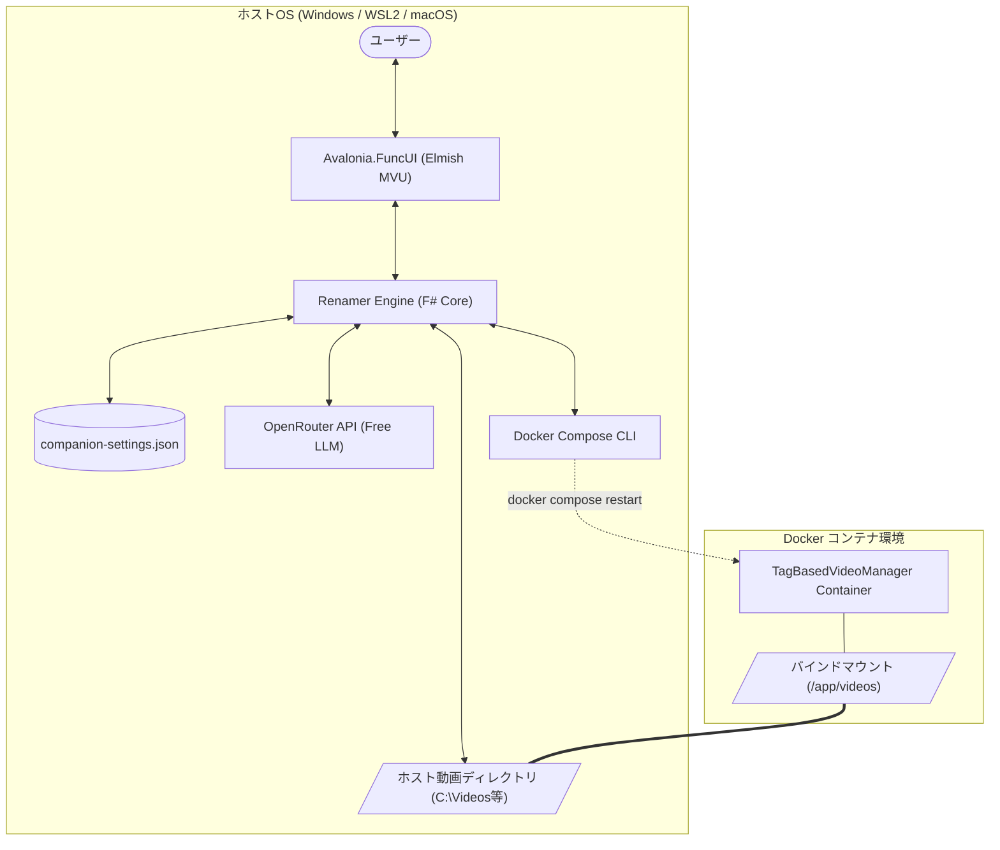
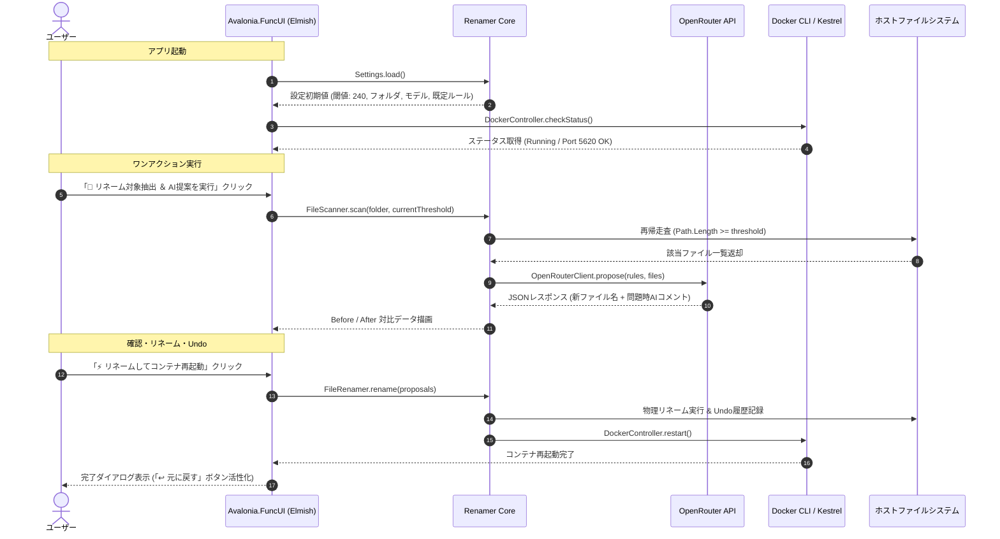

# 詳細設計書: TagBasedVideoManager - AI File Renamer

## 1. システム構成とデータフロー

### 1.1 物理・データフロー構成

本システムは、ホストOS（Windows / WSL2 / macOS / Linux）上で動作する独立したデスクトップアプリケーションであり、純粋な **100% F# (.NET 10) ＋ Avalonia.FuncUI (Elmish MVU)** で構築されます。
Dockerバインドマウント（WSL2/9p）のパス長制限（260文字）によるマウント失敗問題を解決するため、ホストファイルシステムを直接走査し、OpenRouter APIのAI支援を受けてファイル名を短縮・正規化リネームし、Docker Compose経由でWebアプリコンテナを再起動します。



### 1.2 処理シーケンス



---

## 2. データモデル設計 (`Domain.fs`)

### 2.1 ドメイン型定義

```fsharp
namespace TagBasedVideoManager.Renamer.Domain

open System

/// 命名規則のドメインモデル
type NamingRule = {
    Id: string
    Name: string
    Pattern: string        // 例: "{{Date}}_{{Summary}}"
    PromptInstruction: string // LLMに対する命名指示
    Order: int             // 並び順 (最小値がデフォルトルール)
}

/// スキャン抽出されたファイル情報
type ScanCandidate = {
    FullPath: string
    FileName: string
    DirectoryPath: string
    PathLength: int
    FileSizeBytes: int64
    LastWriteTime: DateTime
}

/// リネーム提案データ
type RenameProposal = {
    OriginalFullPath: string
    OriginalFileName: string
    DirectoryPath: string
    OriginalLength: int
    ProposedFileName: string
    ProposedLength: int
    AiComment: string option // 問題・補完発生時のみ Some
    IsSelected: bool
}

/// リネームUndo履歴レコード
type UndoRecord = {
    Id: Guid
    Timestamp: DateTime
    OriginalFullPath: string
    RenamedFullPath: string
}

/// Dockerコンテナ稼働ステータス
type ContainerState =
    | Running
    | Stopped
    | Restarting
    | Unhealthy
    | NotFound

type DockerStatus = {
    State: ContainerState
    IsPortAccessible: bool // ポート5620のHTTP疎通
    ContainerId: string option
    LastChecked: DateTime
}

/// アプリケーション永続化設定
type RenamerSettings = {
    TargetDirectory: string
    PathLengthThreshold: int // 初期値: 240 (※起動中の変更はメモリ上のみで非保存)
    SelectedModel: string
    ApiKey: string option
    Rules: NamingRule list
}

/// 表示レイアウト種別
type LayoutMode =
    | Vertical   // 上下並び (極低ハイト設計・視線移動最小化)
    | Horizontal // 左右並び (横長ワイド対比)

/// ROP (Railway Oriented Programming) のためのエラー型
type RenamerError =
    | IoError of message: string * ex: exn option
    | SettingsError of message: string
    | OpenRouterError of statusCode: int * message: string
    | DockerError of command: string * exitCode: int * stderr: string
    | ValidationError of message: string
    | UndoConflictError of path: string * message: string
```

---

## 3. 設定ファイル・外部連携スキーマ設計

### 3.1 設定ファイル スキーマ (`companion-settings.json`)

アプリケーション設定は実行ファイルと同ディレクトリ（またはユーザープロファイル）の `companion-settings.json` にJSON形式で保存されます。
※**セキュリティ配慮**: APIキー（`apiKey`）が保存される可能性があるため、本設定ファイル（実環境ファイル）は `.gitignore` に登録し、Git管理から除外します（プロジェクトにはテンプレート `companion-settings.example.json` を提供）。

```json
{
  "$schema": "http://json-schema.org/draft-07/schema#",
  "title": "RenamerSettings",
  "type": "object",
  "properties": {
    "targetDirectory": { "type": "string" },
    "pathLengthThreshold": { "type": "integer", "default": 240 },
    "selectedModel": {
      "type": "string",
      "default": "meta-llama/llama-3.3-70b-instruct:free"
    },
    "apiKey": { "type": ["string", "null"] },
    "rules": {
      "type": "array",
      "items": {
        "type": "object",
        "properties": {
          "id": { "type": "string" },
          "name": { "type": "string" },
          "pattern": { "type": "string" },
          "promptInstruction": { "type": "string" },
          "order": { "type": "integer" }
        },
        "required": ["id", "name", "pattern", "promptInstruction", "order"]
      }
    }
  },
  "required": [
    "targetDirectory",
    "pathLengthThreshold",
    "selectedModel",
    "rules"
  ]
}
```

### 3.2 OpenRouter API連携仕様

- **エンドポイント**: `POST https://openrouter.ai/api/v1/chat/completions`
- **モデル**: Freeモデル（既定: `meta-llama/llama-3.3-70b-instruct:free`）
- **プロンプト構造**:
  - **System Prompt**:
    ```text
    あなたはファイル名の短縮・正規化を行う専門AIです。
    提供されたファイル一覧に対し、指定の命名規則に従って安全で簡潔なファイル名を生成してください。
    出力は必ず指定されたJSONフォーマットのみを返し、余計な解説文やMarkdownタグを含めないでください。
    ```
  - **User Prompt**:
    ```text
    【命名規則】: {RuleName}
    【命名パターン】: {Pattern}
    【命名指示】: {PromptInstruction}

    【ファイル一覧】:
    1. FullPath: "...", FileName: "...", ParentFolder: "...", LastModified: "..."
    ...

    【出力JSON仕様】:
    [
      {
        "originalFileName": "元ファイル名",
        "proposedFileName": "新ファイル名.mp4",
        "aiComment": "問題点・補完理由（※規則通り命名できた場合は null または空文字にすること）"
      }
    ]
    ```

### 3.3 Docker Compose コマンド仕様

- **ステータス確認**: `docker compose ps --format json`
  - **バージョン差異対応**: Docker Compose v2 のマイナーバージョン差異により、「単一JSON配列 `[{...}]`」で返る場合と「改行区切りNDJSON」で返る場合があります。デシリアライザーにて両形式（配列パース失敗時に行区切り分割パース）へ自動フォールバックして耐障害性を担保します。
- **コンテナ再起動**: `docker compose restart tag-based-video-manager`
- **コンテナ起動 / 停止**: `docker compose up -d` / `docker compose stop`

---

## 4. モジュール別詳細設計 & 関数シグネチャ

### 4.1 設定管理モジュール (`Settings.fs`)

```fsharp
namespace TagBasedVideoManager.Renamer

open TagBasedVideoManager.Renamer.Domain

module Settings =
    /// 既定の設定値を生成
    val defaultSettings: unit -> RenamerSettings

    /// 指定パスから設定ファイルを読み込む
    val load: filePath: string -> Result<RenamerSettings, RenamerError>

    /// 指定パスへ設定ファイルを保存する
    val save: filePath: string -> settings: RenamerSettings -> Result<unit, RenamerError>

    /// 命名ルールの並び順を更新する
    val reorderRules: ruleIdsInOrder: string list -> settings: RenamerSettings -> RenamerSettings
```

- **セッション内一時変更の保証**: UI上で閾値（`PathLengthThreshold`）が変更された場合、Elmish の `Model` のみ更新し、`Settings.save` は一切呼び出しません。

### 4.2 ファイル走査モジュール (`FileScanner.fs`)

```fsharp
namespace TagBasedVideoManager.Renamer

open TagBasedVideoManager.Renamer.Domain

module FileScanner =
    /// 指定フォルダを再帰走査し、絶対パス長が閾値以上の動画ファイルを抽出する
    val scanLongPaths:
        targetDirectory: string ->
        threshold: int ->
        Result<ScanCandidate list, RenamerError>
```

- **アルゴリズム**:
  - `Directory.EnumerateFiles(targetDir, "*.*", SearchOption.AllDirectories)` を使用。
  - 対象拡張子: `.mp4`, `.mkv`, `.avi`, `.mov`, `.wmv`, `.webm`, `.flv`。
  - **大文字小文字不問判定**: Windows/Linux間の差異を吸収するため、`StringComparison.OrdinalIgnoreCase` を用いて拡張子を判定。
  - 各ファイルの完全パス長（`file.Length`）を算出し、`length >= threshold` のものを抽出。
  - アクセス権限エラー（`UnauthorizedAccessException`）発生時は例外を握りつぶさず安全にスキップまたはログ記録。

### 4.3 OpenRouter APIクライアント (`OpenRouterClient.fs`)

```fsharp
namespace TagBasedVideoManager.Renamer

open TagBasedVideoManager.Renamer.Domain

module OpenRouterClient =
    /// AIモデルへリネーム候補を問い合わせる
    val requestProposals:
        httpHandler: (string -> string -> Async<int * string>) option -> // テスト用モック注入
        apiKey: string option ->
        model: string ->
        rule: NamingRule ->
        candidates: ScanCandidate list ->
        Async<Result<RenameProposal list, RenamerError>>
```

- **AIコメント制御ロジック**:
  - AIレスポンス内の `aiComment` が空文字または `"null"` の場合は `None` に正規化。
  - 元ファイル名が記号の羅列等で日時や地名が存在せず、親フォルダやファイル更新日時から代替補完した場合のみ `Some("...")` を保持。
  - レスポンスのJSONパースに失敗した場合、Markdownのコードブロック記号（`json ... `）を自動トリムして再パースを試行。

### 4.4 物理リネーム・Undoエンジン (`FileRenamer.fs`)

```fsharp
namespace TagBasedVideoManager.Renamer

open TagBasedVideoManager.Renamer.Domain

module FileRenamer =
    /// 選択されたリネーム提案を一括実行し、Undo履歴レコードを生成する
    val executeRename:
        proposals: RenameProposal list ->
        Result<UndoRecord list, RenamerError>

    /// 直前のリネーム履歴に基づいて逆リネームを実行し、元に戻す
    val executeUndo:
        records: UndoRecord list ->
        Result<unit, RenamerError>
```

- **同名衝突回避アルゴリズム**:
  - 移動先パスが既に存在する場合、ファイル名の末尾に `_1`, `_2` のようなサフィックスを付与して安全に一意化。
- **Undoの安全設計**:
  - Undo実行時に、元ファイル名が既に別の新規ファイルで占有されている場合は `UndoConflictError` を返し、上書き破壊を防止。

### 4.5 Dockerコントローラー (`DockerController.fs`)

```fsharp
namespace TagBasedVideoManager.Renamer

open TagBasedVideoManager.Renamer.Domain

module DockerController =
    /// コンテナのステータスおよびポート5620の疎通を確認する
    val checkStatus:
        workingDirectory: string ->
        Async<DockerStatus>

    /// Docker Compose アクションを実行する
    val executeAction:
        workingDirectory: string ->
        action: string -> // "up -d" | "stop" | "restart"
        Async<Result<string, RenamerError>>
```

---

## 5. UI/UX & Elmish アーキテクチャ詳細設計 (`State.fs` & `Views.fs`)

### 5.1 Elmish Model 定義

```fsharp
type Model = {
    // 設定
    Settings: RenamerSettings
    CurrentThreshold: int         // UIで変更可能なセッション限定閾値
    SelectedRuleId: string

    // 状態
    IsScanning: bool
    IsRequestingAi: bool
    IsRenaming: bool
    ErrorMessage: string option

    // データ
    Candidates: RenameProposal list
    UndoStack: UndoRecord list list // 1回のリネーム単位でスタック保持
    Docker: DockerStatus

    // UI表示設定
    Layout: LayoutMode
    IsRuleManagerOpen: bool
    EditingRule: NamingRule option
}
```

### 5.2 Elmish Msg 定義

```fsharp
type Msg =
    // 初期化・設定
    | SettingsLoaded of Result<RenamerSettings, RenamerError>
    | ThresholdChanged of int
    | TargetDirectoryChanged of string
    | RuleSelected of string

    // 走査 & AI提案 (ワンアクション)
    | ExecuteScanAndPropose
    | ScanCompleted of Result<ScanCandidate list, RenamerError>
    | AiProposeCompleted of Result<RenameProposal list, RenamerError>

    // 候補編集
    | ToggleCandidateSelect of fullPath: string
    | SelectAllCandidates of bool
    | UpdateProposedName of fullPath: string * newName: string

    // リネーム実行 & Undo
    | ExecuteRenameOnly
    | ExecuteRenameAndRestart
    | RenameCompleted of Result<UndoRecord list, RenamerError>
    | ExecuteUndo
    | UndoCompleted of Result<unit, RenamerError>

    // Docker連携
    | DockerStatusUpdated of DockerStatus
    | DockerCommandCompleted of action: string * Result<string, RenamerError>

    // 表示切り替え & ルール管理モーダル
    | SetLayoutMode of LayoutMode
    | OpenRuleManager
    | CloseRuleManager
    | SaveRule of NamingRule
    | DeleteRule of ruleId: string
    | MoveRuleOrder of ruleId: string * direction: int // -1: up, +1: down
    | DismissError
```

### 5.3 UIレイアウト構造 (`Views.fs`)

- **Docker Status Bar**: 画面最上部に常駐。ステータスバッジ（緑: RUNNING, 灰: STOPPED, 赤: UNHEALTHY）と、[▶ Start] [■ Stop] [🔄 Restart] ボタン。
- **Control Panel**:
  - 対象フォルダ入力欄 ＆ [参照...] ボタン
  - 抽出基準数値ボックス: `≧ [ 240 ] 文字 (※一時変更・設定非保存)`
  - 該当件数バッジ
  - モデル選択ドロップダウン、命名規則選択ドロップダウン ＆ [⚙ 管理...] ボタン
  - メインアクションボタン: `[ 🚀 リネーム対象抽出 ＆ AI提案を実行 (ワンアクション) ]`
- **Before / After Comparison List**:
  - 表示形式トグル: `[ ▤ 上下並び ] [ ◫ 左右並び ]`
  - **上下並び (Vertical)**:
    - 高さ最小化カード構成。
    - 上行: `BEFORE (251字 [危険]): 元のとても長いファイル名.mp4`
    - 下行: `AFTER  ( 42字 [安全]): [ 20250812_Wakkanai_Motorcycle.mp4 ] (-209字削減)`
    - 問題発生時のみ下部に `⚠️ AIコメント: 元名に日時情報がないため親フォルダより補完` を表示。
- **Footer Actions**:
  - 選択件数表示、`[ ↩ 直前のリネームを元に戻す (Undo) ]` ボタン（履歴あり時のみ活性化）
  - `[ リネームのみ実行 ]` ボタン ＆ `[ ⚡ リネームしてコンテナ再起動 (復旧) ]` ボタン
  - **Undo確認ダイアログ**: Undo実行時は「変更前の長ファイル名に復元され、コンテナが再起動します」と明示して意図しない再起動による驚きを防止。

---

## 6. テスト・品質検証設計

### 6.1 テスト駆動開発 (TDD) 方針

すべてのCore機能およびロジックは、**Red（失敗する単体テスト）→ Green（最小実装）→ Refactor（リファクタリング）** の順で開発を進めます。

### 6.2 テストコードとテスト対象の 1:1 対応関係マッピング表

| テストファイル                                | テスト対象モジュール          | 検証内容・主要アサーション                                                                                                                 | 異常系・境界値テスト                                                                                                                 |
| :-------------------------------------------- | :---------------------------- | :----------------------------------------------------------------------------------------------------------------------------------------- | :----------------------------------------------------------------------------------------------------------------------------------- |
| **`test/.../SettingsTests.fs`**               | `src/.../Settings.fs`         | ・初期閾値 240文字のロード<br>・命名規則リストのシリアライズ/デシリアライズ<br>・ルールの並び替えと優先度更新                              | ・不正なJSON形式時のフォールバック<br>・**UIで閾値変更時に設定ファイルが書き換えられないことの検証**                                 |
| **`test/.../FileScannerTests.fs`**            | `src/.../FileScanner.fs`      | ・指定フォルダの再帰走査<br>・パス長 ≧ threshold のファイル抽出<br>・対象動画拡張子のフィルタリング                                        | ・空フォルダ、存在しないパス<br>・閾値ちょうどの境界値（239文字 / 240文字 / 241文字）<br>・アクセス権限エラー時の安全スキップ        |
| **`test/.../OpenRouterClientTests.fs`**       | `src/.../OpenRouterClient.fs` | ・モックHTTPによるAPIレスポンスパース<br>・命名規則プロンプト構築の妥当性<br>・**正常時 `aiComment = None`、問題時のみ `Some` となる判定** | ・Markdownコードブロックの自動除去<br>・不正JSON時のフォールバック<br>・HTTPタイムアウトおよびステータスエラー                       |
| **`test/.../FileRenamerTests.fs`**            | `src/.../FileRenamer.fs`      | ・物理ファイル名のリネーム実行<br>・Undo履歴レコードの生成<br>・**Undo実行による完全な元ファイル名復元**                                   | ・同名ファイル存在時の自動連番サフィックス<br>・ファイルロック中のエラーハンドリング<br>・Undo時に元名が占有されている場合の衝突検知 |
| **`test/.../DockerControllerTests.fs`**       | `src/.../DockerController.fs` | ・`docker compose ps --format json` のパース<br>・コンテナ稼働状態（Running/Stopped/Unhealthy）判定<br>・ポート5620のHTTPヘルスチェック    | ・Docker CLI 未インストール / 未起動時のエラー処理<br>・非0終了コード時の標準エラー捕捉                                              |
| **`test/.../RenameIntegrationE2ETests.fs`**   | 全モジュール結合              | ・一時フォルダへの実ファイル生成<br>・スキャン → AI提案 → リネーム → 整合性確認 → Undo復元の一気通貫検証                                   | ・260文字超過ファイルの実リネーム検証<br>・連続リネーム後の連続Undo検証                                                              |
| **`test/TagBasedVideoManager.Tests/` (既存)** | 既存Webアプリ全体             | ・フォルダ移動後の全既存テスト一括実行                                                                                                     | ・**フォルダ再編によるリグレッションがゼロであることの回帰検証**                                                                     |
